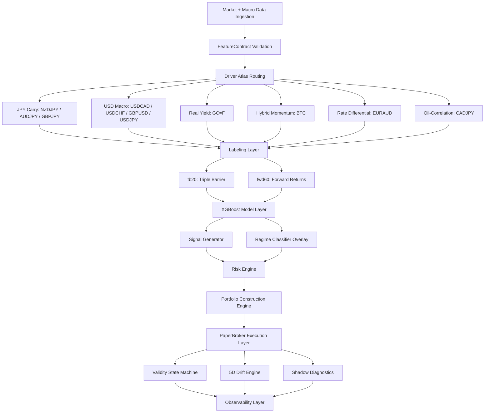

# QUANTFORGE — SYSTEM SPECIFICATION


---

## TABLE OF CONTENTS

1. [System Overview](#1-system-overview)
2. [System Objective](#2-system-objective)
3. [Getting Started](#3-getting-started)
4. [Live Simulation Portfolio](#4-live-simulation-portfolio)
5. [Data Architecture](#5-data-architecture)
6. [Model Architecture](#6-model-architecture)
7. [Validation Framework](#7-validation-framework)
8. [Execution System (Paper Trading Engine)](#8-execution-system-paper-trading-engine)
9. [Risk & Governance Layer](#9-risk--governance-layer)
10. [Model Governance System](#10-model-governance-system)
11. [Shadow Analytics System](#11-shadow-analytics-system)
12. [System Architecture (Causal Execution Graph)](#12-system-architecture-causal-execution-graph)
13. [System Invariants](#13-system-invariants)
14. [Infrastructure Design](#14-infrastructure-design)
15. [Known Constraints](#15-known-constraints)
16. [Research Status](#16-research-status)
17. [System Classification](#17-system-classification)
18. [Disclaimer](#18-disclaimer)

---

## 1. SYSTEM OVERVIEW

QuantForge is a modular quantitative research and simulation system for **macro-driven systematic strategies across FX, commodities, equities, and digital assets**.

It implements a full lifecycle pipeline:

* Feature engineering under strict schema contracts
* Walk-forward out-of-sample validation
* Regime-conditioned signal generation
* Portfolio construction with volatility targeting
* Continuous paper trading simulation
* Multi-layer governance and adversarial validation

The system is strictly designed for **research and simulation under realistic market constraints**.

---

## 2. SYSTEM OBJECTIVE

QuantForge evaluates whether **macro-conditioned statistical structure produces persistent predictive edge under non-stationary market regimes**.

Primary research constraints:

* Structural regime shifts
* Feature interference across heterogeneous assets
* Cross-asset correlation instability
* Temporal decay of predictive signals
* Robustness under adversarial perturbation

All strategies must pass **walk-forward validation and governance gating** prior to inclusion in the simulation portfolio.

---

## 3. GETTING STARTED

### 3.1 Installation

```bash
git clone https://github.com/user/quantforge.git
cd quantforge

python -m venv .venv
source .venv/bin/activate

pip install -r requirements.txt
```

### 3.2 Environment Configuration

```env
FRED_API_KEY=your_key_here
PYTHONPATH=.
```

### 3.3 System Execution

Start full simulation system (builds dashboard, starts engine, serves UI):

```bash
./monitor_all
```

Or manually:

```bash
python paper_trading/monitor.py
```

Dashboard (React + TypeScript + Tailwind CSS):

```
http://localhost:5000
```

Features landing page with flashlight hero reveal, 11 live components (AssetCard, EquityChart, SignalsTable, PortfolioSummary, VolRegimePanel, MetricsGrid, ConfidenceChart, TradeFeed, HaltConditions, Footer, Header), dark/light theme toggle, GSAP-powered transitions.

Rebuild dashboard after frontend changes:

```bash
(cd paper_trading/dashboard && yarn build)
```

Dev mode (port 3000, proxies /state.json to port 5000):

```bash
(cd paper_trading/dashboard && yarn dev)
```

Run backtest:

```bash
python equity/walk_forward_eurusd.py
```

---

## 4. LIVE SIMULATION PORTFOLIO

The system maintains an 11-asset continuously evaluated simulation portfolio.

| Asset  | Ticker   | Label | Cluster         | Allocation | sl_mult | tp_mult | R:R |
| ------ | -------- | ----- | --------------- | ---------- | ------- | ------- | --- |
| BTC    | BTC-USD  | tb20  | momentum_crypto | 14%        | 1.5     | 3.0     | 1:2 |
| EURAUD | EURAUD=X | tb20  | eur_cross       | 17%        | 1.0     | 2.5     | 1:2.5 |
| GC     | GC=F     | fwd60 | real_asset      | 15%        | 1.2     | 4.0     | 1:3.3 |
| NZDJPY | NZDJPY=X | tb20  | carry_fx        | 11%        | 1.0     | 2.5     | 1:2.5 |
| CADJPY | CADJPY=X | tb20  | oil_carry       | 10%        | 0.8     | 3.5     | 1:4.4 |
| AUDJPY | AUDJPY=X | tb20  | carry_fx        | 7%         | 1.0     | 2.5     | 1:2.5 |
| USDCAD | USDCAD=X | tb20  | usd_macro       | 7%         | 1.0     | 2.5     | 1:2.5 |
| GBPJPY | GBPJPY=X | tb20  | carry_fx        | 6%         | 1.0     | 2.5     | 1:2.5 |
| USDJPY | USDJPY=X | tb20  | usd_macro       | 5%         | 1.0     | 2.5     | 1:2.5 |
| USDCHF | USDCHF=X | tb20  | usd_macro       | 4%         | 1.0     | 2.5     | 1:2.5 |
| GBPUSD | GBPUSD=X | tb20  | usd_macro       | 4%         | 1.0     | 2.5     | 1:2.5 |

> `sl_mult` and `tp_mult` are configured in `configs/paper_trading.yaml`. Stop-loss = vol × sl_mult, take-profit = vol × tp_mult. The resulting R:R = tp_mult / sl_mult. Each asset's triple-barrier training labels (`pt_sl` in `features/registry.py`) must match these runtime multipliers — enforced by startup validation in `PaperTradingEngine.initialize()`.

Execution is fully simulated via a broker abstraction layer using Yahoo Finance market data.

---

## 5. DATA ARCHITECTURE

### 5.1 Data Sources

* Yahoo Finance (OHLCV)
* FRED macroeconomic series
* Parquet-based deterministic cache layer

### 5.2 Feature Governance

All features are enforced via a **Feature Contract System** ensuring:

* Deterministic computation across train/inference
* Runtime schema validation
* Elimination of train/serve skew

Each asset is mapped to a **driver-specific feature subspace** to prevent cross-regime contamination.

---

## 6. MODEL ARCHITECTURE

### 6.1 Core Model

* XGBoost multiclass classifier
* Outputs: BUY / HOLD / SELL
* Configuration:

  * 300 trees
  * max_depth = 2
  * learning_rate = 0.02

### 6.2 Labeling Regimes

* **tb20**: Triple-barrier event labeling (20-bar horizon). Take-profit and stop-loss levels are set per-asset via `ASSET_LABEL_PARAMS` in `features/registry.py` — the `pt_sl` array `[tp_mult, sl_mult]` must match runtime `tp_mult`/`sl_mult` from `configs/paper_trading.yaml`.
* **fwd60**: 60-day forward return classification with fixed threshold.

Label selection is asset-specific and regime-derived. Training/execution alignment is enforced by startup validation.

---

## 7. VALIDATION FRAMEWORK

### 7.1 Walk-Forward Protocol

* 5-year training window
* 1-year out-of-sample window
* Rolling evaluation (2021–2025)
* Strict temporal isolation (no leakage)

### 7.2 Evaluation Metrics

* Sharpe ratio (annualized)
* Maximum drawdown
* Directional accuracy
* Stability of positive return windows

### 7.3 Empirical Results

Walk-forward results for live portfolio assets and screened candidates.

| Asset  | Sharpe | Stability | Notes                       |
| ------ | ------ | --------- | --------------------------- |
| NZDJPY | 2.72   | 5/5       | strongest carry structure   |
| EURAUD | 2.28   | 5/5       | feature augmentation uplift |
| CADJPY | 1.70   | 4/5       | regime-dependent uplift     |
| USDCHF | 1.64   | 4/5       | screened, now live          |
| USDCAD | 1.48   | 4/5       | stable macro sensitivity    |
| USDJPY | 1.28   | 4/5       | screened, now live          |
| GBPUSD | 1.24   | 4/5       | screened, now live          |
| GC=F   | 1.06   | 4/5       | macro persistence observed  |
| GBPJPY | 1.75   | 4/5       | screened, now live          |
| BTC    | 0.83   | 3/5       | structurally unstable       |
| AUDJPY | 2.62   | 5/5       | screened, now live          |

> Results for newly promoted assets (AUDJPY, GBPJPY, USDJPY, USDCHF, GBPUSD) are from 5-year walk-forward screening with generic feature templates. Asset-specific driver features may improve performance.

---

## 8. EXECUTION SYSTEM (PAPER TRADING ENGINE)

### 8.1 System Structure

* Asset-level execution engines
* Position lifecycle manager
* Broker simulation layer
* Portfolio aggregation layer

### 8.2 Core Abstractions

* TradeDecision: model output intent
* PositionIntent: execution representation
* PositionManager: lifecycle + PnL accounting

Separation is enforced between:

* Signal generation
* Execution logic
* Accounting layer

### 8.3 Portfolio Mechanics

* Volatility-scaled position sizing
* Asset-level allocation constraints
* Drawdown-based risk halting
* Mark-to-market PnL tracking

### 8.4 Per-Asset Risk Multipliers

Stop-loss and take-profit distances are set per asset via `configs/paper_trading.yaml`:

```yaml
assets:
  BTC:
    sl_mult: 1.5    # stop = entry × (1 − vol × 1.5)
    tp_mult: 3.0    # take-profit = entry × (1 + vol × 3.0)
```

The `PositionIntent.from_price_and_vol()` factory in `paper_trading/decision.py` accepts these parameters and computes SL/TP from current volatility:

```python
# Long: sl = entry × (1 − vol × sl_mult), tp = entry × (1 + vol × tp_mult)
# Short: sl = entry × (1 + vol × sl_mult), tp = entry × (1 − vol × tp_mult)
```

This replaces the original hardcoded 1:1 ratio with asset-tuned values (e.g., CADJPY at 0.8×/3.5× for carry trends, GC at 1.2×/4.0× for macro gold runs).

### 8.5 Configuration

The engine reads `configs/paper_trading.yaml`:

| Key | Default | Description |
| --- | ------- | ----------- |
| `capital` | 100000 | Starting capital |
| `position_size` | 0.95 | Fraction of capital per position |
| `rebalance` | daily | Rebalance frequency |
| `halt.drawdown` | -0.08 | Global drawdown halt threshold |
| `halt.monthly_pf` | 0.70 | Monthly profit factor minimum |
| `halt.signal_drought` | 30 | Max days without signal |
| `halt.prob_drift` | 0.15 | Max confidence drift from expected |
| `research_mode` | false | Enables shadow-only execution |
| `assets.<name>.allocation` | — | Portfolio weight (must sum to 1.0) |
| `assets.<name>.sl_mult` | 1.0 | Stop-loss volatility multiplier |
| `assets.<name>.tp_mult` | 2.5 | Take-profit volatility multiplier |
| `assets.<name>.config.vol_scalar` | false | Enable volatility scaling (BTC only) |

Asset-level `halt` settings override global defaults.

### 8.6 Training Alignment Validation

On startup, `PaperTradingEngine.initialize()` asserts runtime multipliers match training labels:

```python
ASSET_LABEL_PARAMS = {
    "BTC": {"pt": 3.0, "sl": 1.5},
    "CADJPY": {"pt": 3.5, "sl": 0.8},
    ...
}
```

If `configs/paper_trading.yaml` has `BTC: sl_mult: 1.5` but `ASSET_LABEL_PARAMS["BTC"]["sl"]` is `1.0`, the engine raises `AssertionError` at startup. This prevents silent training/execution misalignment — the triple-barrier labels used during model training must produce the same SL/TP distances the engine uses at runtime.

---

## 9. RISK & GOVERNANCE LAYER

### 9.1 Validity State Machine

* GREEN → full allocation
* YELLOW → reduced exposure
* RED → halted

Transitions depend on:

* Drawdown thresholds
* Signal degradation
* Drift indicators

---

### 9.2 Drift Monitoring (5D)

* KL divergence (model shift)
* Signal flip rate
* PnL MAE
* Feature set Jaccard similarity
* Regime consistency score

---

### 9.3 Risk Engine Output

* Composite risk score
* Exposure scaling recommendation
* Advisory-only execution signals

---

## 10. MODEL GOVERNANCE SYSTEM

Pipeline:

1. Sandbox retraining
2. Four-lens evaluation (model / signal / portfolio / shadow)
3. Walk-forward validation
4. MAS scoring (6-dimensional compression metric)
5. Adversarial regime stress testing (9 perturbation modes)
6. Promotion gate evaluation

### Outcome Classes

* LIVE_CANDIDATE
* PAPER_TRADING_ONLY
* SHADOW_ONLY
* REJECT

---

## 11. SHADOW ANALYTICS SYSTEM

Parallel observability layer operating independently of execution:

* Shadow trade replication
* Drift attribution analysis
* Feature sensitivity mapping
* Regime failure classification
* Longitudinal behavioral memory

This subsystem is strictly **non-executional**.

---

## 12. SYSTEM ARCHITECTURE (CAUSAL EXECUTION GRAPH)

The system is implemented as a deterministic transformation pipeline:



---

## 13. SYSTEM INVARIANTS

* No train/serve skew (FeatureContract enforced)
* Deterministic replay via state store
* Strict signal/execution separation
* Stateless inference layer
* Backtest/live parity enforcement

---

## 14. INFRASTRUCTURE DESIGN

* Stateless model inference layer
* Stateful execution engine
* Schema-versioned persistence layer
* Crash-safe recovery snapshots
* Local HTTP observability dashboard
* Cached market data subsystem

---

## 15. KNOWN CONSTRAINTS

* Paper trading only (no live execution)
* Data limited to Yahoo Finance + FRED
* Weekend liquidity discontinuities
* EURUSD excluded (pending COT integration)
* Non-stationary feature effectiveness
* Ensemble layer not yet activated in production loop

---

## 16. RESEARCH STATUS

* 11-asset live simulation active
* 30+ assets evaluated via walk-forward testing
* EURAUD classified as first LIVE_CANDIDATE
* 24 untested FX pairs screened; top performers promoted to live portfolio
* Full governance pipeline operational
* Shadow system continuously accumulating behavioral dataset

---

## 17. SYSTEM CLASSIFICATION

> Macro-conditioned systematic trading research platform with full lifecycle governance, adversarial validation, and execution simulation infrastructure.

Designed to evaluate persistence of macro-driven structure under regime stress and cross-asset generalization constraints.

---

## 18. DISCLAIMER

Research system only. No live capital execution. Not financial advice. Historical simulation results are not indicative of future performance.
