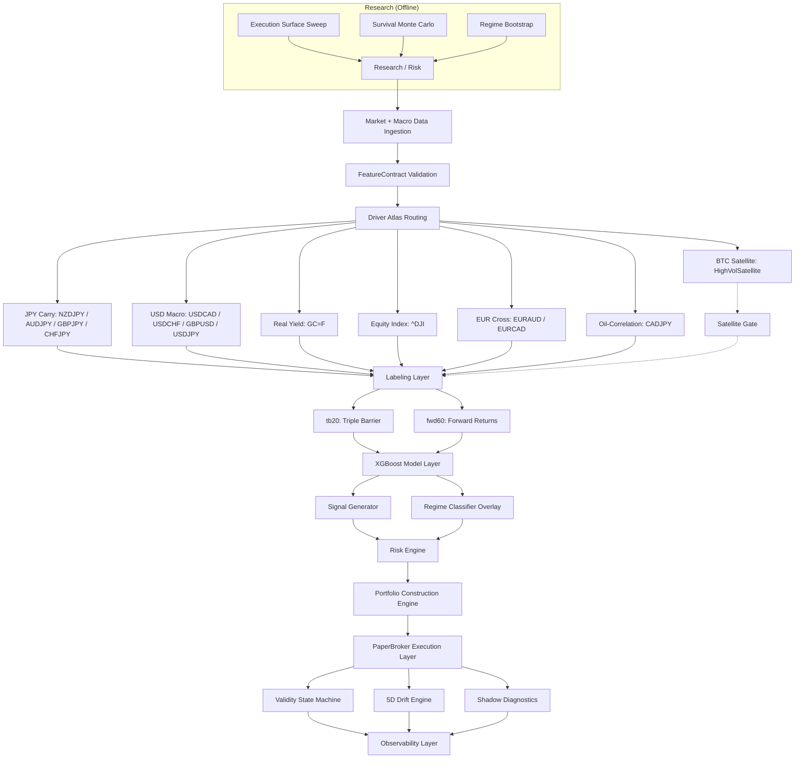

# QUANTFORGE


---

## TABLE OF CONTENTS

1. [System Overview](#1-system-overview)
2. [System Objective](#2-system-objective)
3. [Getting Started](#3-getting-started)
4. [Live Simulation Portfolio](#4-live-simulation-portfolio)
5. [Data Architecture](#5-data-architecture)
6. [Feature Engineering](#6-feature-engineering)
7. [Model Architecture](#7-model-architecture)
8. [Labeling & Signal Generation](#8-labeling--signal-generation)
9. [Validation Framework](#9-validation-framework)
10. [Execution System (Paper Trading Engine)](#10-execution-system-paper-trading-engine)
11. [Risk & Governance Layer](#11-risk--governance-layer)
12. [Survival Monte Carlo Simulation](#12-survival-monte-carlo-simulation)
13. [Shadow Analytics System](#13-shadow-analytics-system)
14. [System Architecture (Causal Execution Graph)](#14-system-architecture-causal-execution-graph)
15. [System Invariants](#15-system-invariants)
16. [Infrastructure Design](#16-infrastructure-design)
17. [Known Constraints](#17-known-constraints)
18. [Research Status](#18-research-status)
19. [System Classification](#19-system-classification)
20. [Disclaimer](#20-disclaimer)

---

## 1. SYSTEM OVERVIEW

QuantForge is a modular quantitative research and simulation system for **macro-driven systematic strategies across FX, commodities, and digital assets**.

It implements a full lifecycle pipeline:

* Feature engineering under strict schema contracts (FeatureContract)
* Walk-forward out-of-sample validation across 5-year rolling windows
* Multi-class XGBoost signal generation (BUY / HOLD / SELL)
* Triple-barrier and forward-return labeling
* Portfolio construction with volatility targeting
* Continuous paper trading simulation with mark-to-market PnL
* Multi-layer governance: drift detection, validity state machine, shadow analytics
* **Survival Monte Carlo simulation** with execution physics, regime-aware bootstrap, and deleveraging feedback
* SL/TP execution surface optimization via replay engine

The system is strictly designed for **research and simulation under realistic market constraints**.

---

## 2. SYSTEM OBJECTIVE

QuantForge evaluates whether **macro-conditioned statistical structure produces persistent predictive edge under non-stationary market regimes**.

Primary research constraints:

* Structural regime shifts
* Feature interference across heterogeneous assets
* Cross-asset correlation instability
* Temporal decay of predictive signals
* Execution friction (spreads, gaps, partial fills)
* Robustness under adversarial perturbation

All strategies must pass **walk-forward validation and governance gating** prior to inclusion in the simulation portfolio.

---

## 3. GETTING STARTED

### 3.1 Installation

```bash
git clone https://github.com/user/quantforge.git
cd quantforge

python -m venv .venv
source .venv/bin/activate

pip install -r requirements.txt
```

### 3.2 Environment Configuration

```env
FRED_API_KEY=your_key_here
PYTHONPATH=.
```

### 3.3 System Execution

Start full simulation system (builds dashboard, starts engine, serves UI):

```bash
./monitor_all
```

Or manually:

```bash
python paper_trading/monitor.py
```

Dashboard (React + TypeScript + Tailwind CSS):

```
http://localhost:5000
```

Rebuild dashboard after frontend changes:

```bash
(cd paper_trading/dashboard && yarn build)
```

Dev mode (port 3000, proxies /state.json to port 5000):

```bash
(cd paper_trading/dashboard && yarn dev)
```

### 3.4 Running Research Simulations

Survival Monte Carlo (v3 — full pipeline):

```bash
python research/risk/survival_sim.py --execution-physics --btc-execution --deleverage --regime-bootstrap --exposure-telemetry
```

SL/TP execution surface sweep:

```bash
python research/execution_surface/surface_sweep.py
```

### 3.5 Running Backtests

```bash
python equity/walk_forward_eurusd.py
python equity/walk_forward_nzdjpy.py
```

---

## 4. LIVE SIMULATION PORTFOLIO

The system maintains a **14-asset continuously evaluated simulation portfolio** with **plateau-optimized SL/TP configurations** derived from execution surface analysis. BTC is isolated in a separate satellite bucket (see §4.1).

| Asset   | Ticker    | Label | Cluster       | Alloc | sl_mult | tp_mult | R:R   |
| ------- | --------- | ----- | ------------- | ----- | ------- | ------- | ----- |
| EURAUD  | EURAUD=X  | tb20  | eur_cross     | 17%   | 0.54    | 1.77    | 1:3.3 |
| GC      | GC=F      | fwd60 | real_asset    | 13%   | 0.51    | 2.67    | 1:5.2 |
| NZDJPY  | NZDJPY=X  | tb20  | carry_fx      | 11%   | 0.51    | 2.02    | 1:4.0 |
| CADJPY  | CADJPY=X  | tb20  | oil_carry     | 9%    | 0.52    | 1.65    | 1:3.2 |
| CHFJPY  | CHFJPY=X  | tb20  | carry_fx      | 7%    | 0.50    | 1.70    | 1:3.4 |
| EURCAD  | EURCAD=X  | tb20  | eur_cross     | 7%    | 0.51    | 1.96    | 1:3.8 |
| AUDJPY  | AUDJPY=X  | tb20  | carry_fx      | 6%    | 0.52    | 2.01    | 1:3.9 |
| USDCAD  | USDCAD=X  | tb20  | usd_macro     | 6%    | 0.52    | 1.90    | 1:3.7 |
| GBPJPY  | GBPJPY=X  | tb20  | carry_fx      | 5%    | 0.50    | 2.22    | 1:4.4 |
| ^DJI    | ^DJI      | tb20  | equity_index  | 5%    | 0.50    | 1.91    | 1:3.8 |
| USDJPY  | USDJPY=X  | tb20  | usd_macro     | 4%    | 0.52    | 1.97    | 1:3.8 |
| USDCHF  | USDCHF=X  | tb20  | usd_macro     | 4%    | 0.52    | 1.95    | 1:3.8 |
| GBPUSD  | GBPUSD=X  | tb20  | usd_macro     | 3%    | 0.52    | 1.97    | 1:3.8 |

* **Cash buffer**: ~3% retained as dynamic risk slack.
* **SL/TP values**: plateau-center configs from aggregate execution surface analysis.
* **Stop-loss** = vol × sl_mult, **take-profit** = vol × tp_mult. Training labels in `features/registry.py` must match runtime multipliers — enforced by `PaperTradingEngine.initialize()`.

### 4.1 BTC Satellite Bucket

Bitcoin is removed from the core portfolio and managed via a `HighVolSatellite` with independent risk controls:

| Property | Value |
|----------|-------|
| Allocation | 5% AUM cap |
| Vol target | 40% annualised |
| Drawdown limit | 25% |
| Regime gate | 5-condition AND logic (correlation, BTC vol, VIX, DXY momentum, CRISIS) |
| Marginal monitoring | Rolling 63d ΔSharpe, alert at -0.5, auto-reduce at -1.0 |

The satellite runs after core portfolio signal generation each tick. BTC trades only when all five gate conditions are met — maximum conservatism.

---

## 5. DATA ARCHITECTURE

### 5.1 Data Sources

* Yahoo Finance (OHLCV) — primary market data
* FRED macroeconomic series (yields, spreads, inflation)
* COT (Commitments of Traders) positioning data
* Parquet-based deterministic cache layer

### 5.2 Data Layout

```
data/
├── raw/               # Raw downloaded OHLCV parquet
├── processed/         # Cleaned, aligned macro factors
├── live/              # Runtime state (state.json, trade journal, equity history)
├── sandbox/           # Research outputs (OOS predictions, SL/TP analysis, risk simulations)
├── shadow_*/          # Shadow analytics persistence
└── loaders/           # Data ingestion (macro, COT, downloads)
```

---

## 6. FEATURE ENGINEERING

### 6.1 Feature Contract System

All features are enforced via a **FeatureContract** to ensure deterministic train/serve parity:

* `features/contract.py` — `FeatureContract` dataclass (ticker, label_type, macro_filters, price windows)
* `features/registry.py` — Ordered registry mapping feature categories to compute functions
* `features/builder.py` — Orchestrates feature computation and triple-barrier label application

### 6.2 Feature Categories

| Module | Features |
|--------|----------|
| `base_features` | OHLCV returns, ranges, gaps |
| `trend_features` | ADX, slope, curvature, path efficiency |
| `volatility_features` | ATR, Parkinson, Yang-Zhang, rolling vol |
| `mean_reversion_features` | RSI, Bollinger z-score, mean reversion strength |
| `regime_features` | Volatility regime classification, trend/range/volatile probabilities |
| `structural_features` | Skew, kurtosis, tail ratio, serial correlation |
| `cross_asset_features` | Inter-asset correlations, relative strength |
| `interaction_features` | Regime contrast, EMA contrast, transition risk |
| `pair_specific` | FX carry, rate differentials |

### 6.3 Driver Atlas

Each asset is mapped to a **driver-specific feature subspace** to prevent cross-regime contamination:

| Asset Group | Primary Drivers |
|-------------|----------------|
| JPY crosses (NZDJPY, AUDJPY, GBPJPY, CHFJPY) | VIX, yield spreads, JPY momentum |
| USD pairs (USDCAD, USDCHF, GBPUSD, USDJPY) | DXY, rate differential, VIX |
| EUR crosses (EURAUD, EURCAD) | Rate differential, DXY, VIX |
| CADJPY | Oil correlation, VIX, yield spreads |
| Equity indices (^DJI) | Rate differential, VIX, DXY, gold correlation, index momentum |
| GC (Gold) | Real yields, breakevens, DXY |
| BTC (satellite) | Momentum, spread vs SPY, VIX |

---

## 7. MODEL ARCHITECTURE

### 7.1 Core Model

* **XGBoost** multiclass classifier
* Outputs: BUY / HOLD / SELL
* Configuration:
  * 300 trees
  * max_depth = 2
  * learning_rate = 0.02
  * Early stopping with validation set

### 7.2 Additional Model Types

* `models/hybrid_ensemble.py` — Hybrid ensemble combining XGBoost with auxiliary models
* `models/macro_expert_head.py` — Macro-economic expert head module for regime-conditioned predictions
* `models/regime/` — Regime classification models
* `models/mean_reversion/` — Mean-reversion specific models

### 7.3 Strategy Interfaces

All model components implement abstract base classes via `shared/`:

* `shared/model.py` — `ModelInterface` (implemented by `XGBoostModel`)
* `shared/signal.py` — `SignalStrategy` (implemented by `FixedThresholdStrategy`)
* `shared/sizing.py` — `PositionSizingStrategy` (implemented by `VolTargetSizing`)
* `shared/pnl.py` — `PnLStrategy`
* `shared/features.py` — `FeaturePipeline`
* `shared/registry.py` — `StrategyRegistry` singleton provides per-asset instances

---

## 8. LABELING & SIGNAL GENERATION

### 8.1 Labeling Regimes

* **tb20**: Triple-barrier event labeling (20-bar horizon). Take-profit and stop-loss levels set per-asset via `ASSET_LABEL_PARAMS` in `features/registry.py`. The `pt_sl` array `[tp_mult, sl_mult]` must match runtime `tp_mult`/`sl_mult` from `configs/paper_trading.yaml`.
* **fwd60**: 60-day forward return classification with fixed threshold.

### 8.2 Signal Pipeline

1. Feature computation via `FeaturePipeline`
2. XGBoost inference → probability distribution (BUY / HOLD / SELL)
3. `FixedThresholdStrategy` converts probabilities to discrete signals
4. `VolTargetSizing` applies volatility-scaled position sizing (active for BTC)
5. `TradeDecision` encapsulates signal + sizing → `PositionIntent` for execution

---

## 9. VALIDATION FRAMEWORK

### 9.1 Walk-Forward Protocol

* 5-year training window
* 1-year out-of-sample window
* Rolling evaluation (2021–2026)
* Strict temporal isolation (no leakage)
* Retrain frequency: annual (configurable)

### 9.2 Evaluation Metrics

* Sharpe ratio (annualized)
* Maximum drawdown
* Directional accuracy
* Stability of positive return windows

### 9.3 Empirical Results (Walk-Forward)

| Asset   | Sharpe | Stability | Notes |
| ------- | ------ | --------- | -------------------------------- |
| NZDJPY  | 2.72   | 5/5       | Strongest carry structure        |
| AUDJPY  | 2.62   | 5/5       | Screened, promoted to live       |
| EURAUD  | 2.28   | 5/5       | Feature augmentation uplift      |
| GBPJPY  | 1.75   | 4/5       | Screened, promoted to live       |
| CADJPY  | 1.70   | 4/5       | Regime-dependent uplift          |
| USDCHF  | 1.64   | 4/5       | Screened, promoted to live       |
| CHFJPY  | 1.62   | 5/5       | Promoted to live (batch 2)       |
| ^DJI    | 1.53   | 4/5       | Equity index, underweight start  |
| USDCAD  | 1.48   | 4/5       | Stable macro sensitivity         |
| EURCAD  | 1.41   | 5/5       | Promoted to live (batch 2)       |
| USDJPY  | 1.28   | 4/5       | Screened, promoted to live       |
| GBPUSD  | 1.24   | 4/5       | Screened, promoted to live       |
| GC      | 1.06   | 4/5       | Macro persistence observed       |
| BTC     | 0.83   | 3/5       | Moved to satellite bucket        |

### 9.4 Model Governance Pipeline

1. Sandbox retraining
2. Four-lens evaluation (model / signal / portfolio / shadow)
3. Walk-forward validation
4. MAS scoring (6-dimensional compression metric)
5. Adversarial regime stress testing (9 perturbation modes)
6. Promotion gate evaluation

**Outcome classes**: LIVE_CANDIDATE → PAPER_TRADING_ONLY → SHADOW_ONLY → REJECT

---

## 10. EXECUTION SYSTEM (PAPER TRADING ENGINE)

### 10.1 System Structure

* `PaperTradingEngine` — Top-level orchestrator, runs signal generation for all assets each tick
* `AssetEngine` — Per-asset execution engine, owns model, features, position manager, validity state
* `PositionManager` — Position lifecycle (open, close, SL/TP checks, PnL) — pure state machine
* `PaperBroker` — Simulated fills at Yahoo Finance prices with configurable slippage/fees

### 10.2 Core Abstractions

* `TradeDecision` — Model output intent (signal, confidence, position_size)
* `PositionIntent` — Execution representation (side, price, SL/TP, vol)
* Separation enforced between: signal generation, execution logic, accounting

### 10.3 Per-Asset Risk Multipliers

Stop-loss and take-profit distances are set per asset via `configs/paper_trading.yaml`:

```yaml
assets:
  BTC:
    sl_mult: 0.58    # stop = entry × (1 − vol × 0.58)
    tp_mult: 1.51    # take-profit = entry × (1 + vol × 1.51)
```

The `PositionIntent.from_price_and_vol()` factory computes SL/TP from current volatility.

### 10.4 Training Alignment Validation

On startup, `PaperTradingEngine.initialize()` asserts runtime multipliers match training labels in `ASSET_LABEL_PARAMS`. This prevents silent training/execution misalignment.

### 10.5 Key Configuration

| Key | Default | Description |
| --- | ------- | ----------- |
| `capital` | 100000 | Starting capital |
| `position_size` | 0.95 | Capital utilization cap |
| `rebalance` | daily | Rebalance frequency |
| `halt.drawdown` | -0.08 | Drawdown halt threshold |
| `halt.monthly_pf` | 0.70 | Monthly profit factor minimum |
| `halt.signal_drought` | 30 | Max days without signal |
| `halt.prob_drift` | 0.15 | Max confidence drift |
| `assets.<name>.allocation` | — | Portfolio weight |
| `assets.<name>.sl_mult` | 1.0 | Stop-loss vol multiplier |
| `assets.<name>.tp_mult` | 2.5 | Take-profit vol multiplier |
| `satellite.enabled` | true | BTC satellite active |
| `satellite.btc_cap_pct` | 0.05 | Max BTC allocation |
| `satellite.vol_target` | 0.40 | BTC vol target |

---

## 11. RISK & GOVERNANCE LAYER

### 11.1 Validity State Machine (Active)

Each asset runs an independent validity state machine in `monitoring/validity_state_machine.py`:

* **GREEN** → full exposure (1.0×)
* **YELLOW** → reduced exposure (0.5×)
* **RED** → halted (0.0× — no PnL accrual)

Transitions use **hysteresis bands**, **exponential inertia smoothing**, and a **regime persistence lock** to prevent rapid state flipping. Input signals:

* Drawdown vs threshold
* Monthly profit factor
* Signal drought (days since last signal)
* Confidence drift from expected baseline

**Exposure gating**: Each tick, `run_once()` calls `update_validity()` and sets `pos_mgr.exposure_multiplier` to the state machine's output. This directly scales all PnL calculations — GREEN=full, YELLOW=half, RED=flat.

### 11.2 Feature Importance Stability Monitoring (PR #4)

Training-window feature importances are persisted per asset per retrain cycle. Two metrics feed into the ValidityStateMachine:

* **Jaccard similarity** (top-10 features): < 0.6 → −0.10 penalty, < 0.4 → −0.25 penalty
* **Spearman rank correlation** (shared features): < 0.7 → −0.08 penalty, < 0.5 → −0.20 penalty
* **Worst-wins aggregation**: the most negative penalty is applied (not averaged)

A model whose top features change between retrain cycles is chasing noise, not reinforcing stable patterns. Stability penalties reduce exposure via the existing validity framework automatically.

### 11.3 Meta-Labeling Layer (PR #5)

A secondary confidence filter applied after the primary XGBoost signal:

* **Model**: Logistic regression, `class_weight='balanced'`, min 50 trades
* **Features** (5): primary confidence, regime state, periods in state, stability penalty, close price
* **Decision bands**: FULL (≥ 0.55, scale 1.0×), REDUCED (≥ 0.40, scale 0.5×), SKIP (< 0.40, scale 0.0×)
* **Integration**: `pos_size *= meta_result.scale_factor` in `_generate_and_apply()` before `TradeDecision`

Logistic regression underfits if no signal exists — a natural guard against overfitting. Class weighting preserves real trade outcome distribution. The SKIP band filters ~30-40% of signals.

### 11.4 Drift Monitoring (5D)

* Model drift (KL divergence)
* Signal flip rate
* PnL MAE
* Feature set Jaccard similarity
* Regime consistency score

### 11.5 Shadow Risk Engine

* `risk_governance.py` — Real-time risk evaluation (composite risk score, exposure multiplier)
* `shadow_actions.py` — Corrective action recommendations (PAUSE / REDUCE / MONITOR)
* Advisory layer — computed but not enforced (validity state machine is the enforcement layer)

---

## 12. SURVIVAL MONTE CARLO SIMULATION

A multi-layer survival simulation framework at `research/risk/` that evaluates portfolio robustness under extreme market conditions with progressively increasing realism.

### 12.1 Execution Physics (`execution_physics.py`)

Models market microstructure degradation:

* **Spread expansion**: Base spread widens proportionally to volatility z-score, capped at max bps
* **Gap risk**: Stop-loss gap-through increases with vol, adding nonlinear downside
* **Partial fills**: Fill probability decays with vol; unfilled orders truncate returns
* **Deleveraging feedback**: When portfolio drawdown exceeds threshold (−10%), exposure is linearly reduced (up to 50% max), then recovers at 0.5%/day when above threshold

**Per-asset execution configs**: BTC-specific parameters (wider spreads, larger gaps, lower fill rates) reflect crypto market microstructure vs FX majors.

### 12.2 Regime-Aware Bootstrap

**Tail-weighted regime classification** (`vol³ composite index`):

* COMPOSITE = weighted avg of each asset's rolling vol z-score
* Weight ∝ vol³ — high-vol assets (BTC) dominate crisis detection
* Thresholds: CALM (<1.0σ), ELEVATED (1.0–2.0σ), CRISIS (>2.0σ)

**Regime-conditioned block sampling**: During bootstrap, blocks are sampled such that the starting day's regime matches the current simulated regime state. This preserves volatility clustering, crisis persistence, and deleveraging feedback compounding.

### 12.3 Portfolio Variant System

| Variant | Description |
|---------|-------------|
| Full Portfolio | All 14 core assets at current allocations |
| BTC Satellite | 14 core assets + BTC satellite bucket at 5% cap |
| No BTC | Excludes BTC entirely, renormalized |
| BTC Legacy 20% | Original 11-asset with BTC at 20% (pre-satellite) |

### 12.4 Stress Scenarios

| Scenario | Description |
|----------|-------------|
| Crypto Bear 2022 | −0.45%/day for 12 months on BTC |
| Flash Crash | −30% single-day shock across all assets |
| Correlation Spike | 6-month period at 0.90 inter-asset correlation + 2× vol + amplified execution friction |

### 12.5 Marginal Contribution Analysis

Leave-one-out delta for each asset against the full portfolio:

* ΔSharpe, ΔAnn.Return%, ΔWorstDD%, ΔCVaR, ΔRuin probability
* Performance assessment: growth engine / stabilizer / contaminant

### 12.6 Exposure Telemetry

Tracks the deleveraging system's behavior across all paths:

* Exposure cone (percentiles of leverage over time)
* Deleveraging trigger rate and frequency
* Regime-bucketed average exposure (CALM vs ELEVATED vs CRISIS)
* Min exposure distribution (crisis severity)

### 12.7 Calibration Results (v4 — 14-Asset Portfolio + BTC Satellite)

| Metric | 14-Asset Full | BTC Satellite | BTC Legacy 20% |
|--------|---------------|---------------|----------------|
| Sharpe | 6.02 | 5.58 | 3.78 |
| Ann.Ret | +24.1% | +22.3% | +22.8% |
| Worst DD | 8.3% | 12.1% | 27.5% |
| Flash Crash DD | 34.1% | 36.2% | 35.8% |
| Ruin | 0% | 0% | 0% |
| 100% Positive Paths | ✓ | ✓ | ✗ |

**Key findings**:

* Portfolio expansion (11→14 assets) improved every risk metric — Sharpe 3.78→6.02, worst DD 27.5%→8.3%, flash crash DD 35.8%→34.1%
* Return compression (-2.4%) from diversification is well within acceptable range
* 100% of simulation paths positive across all variants
* Deleveraging activates on ~12% of paths (was ~15% in v3)
* BTC satellite shows measurable improvement over legacy 20%: ΔSharpe +1.80, ΔWorstDD −15.4pp
* CHFJPY and EURCAD are net positive contributors across all metrics
* ^DJI shows small negative ΔSharbe (−0.11) — under monitoring

### 12.8 SL/TP Execution Surface Optimization

The `research/execution_surface/` module runs OHLCV-driven replay simulation over SL/TP grids to find plateau-center configurations:

* `replay_engine.py` — OHLCV-driven trade lifecycle simulation
* `surface_sweep.py` — Sweeps SL/TP combinations across parameter space
* `sltp_surface.py` — SL/TP plateau analysis; centre selected over global max for robustness
* `monte_carlo.py` — Monte Carlo validation of selected SL/TP parameters
* Aggregate reports at `data/sandbox/sltp_analysis/aggregate_report.json`

### 12.9 Simulation Snapshot System (PR #6)

Full engine state captured per asset at each `save_state()` call for deterministic replay:

* **Storage**: `data/live/snapshots/simulation_history.parquet` — row-based parquet with positions, trade_log, prob_history, validity state, meta-model inference, feature stability metrics
* **Cold state**: model pickle files stored separately as external references (not duplicated per snapshot)
* **Load modes**: exact timestamp, date-prefix, date listing
* **Deduplication**: on (timestamp, asset)
* **Use cases**: replay from any historical date, SQL-like analysis ("what was every asset's position on all Mondays?")

---

## 13. SHADOW ANALYTICS SYSTEM

Parallel observability layer operating independently of execution:

* **Shadow trade replication**: Wrapper strategy runs alongside primary model
* **Drift attribution**: KL divergence, signal divergence, feature impact
* **Regime context analysis**: Market regime classification overlay
* **Shadow feedback**: Structured event logging (signal + drift + risk + action)
* **Shadow learning**: Longitudinal behavioral memory and drift trends

This subsystem is strictly **non-executional**.

---

## 14. SYSTEM ARCHITECTURE

The system is implemented as a deterministic transformation pipeline:



---

## 15. SYSTEM INVARIANTS

* No train/serve skew (FeatureContract enforced)
* No look-ahead in feature construction (macro data lagged to publication date)
* Deterministic replay via simulation snapshot system (parquet rows + model pickle references)
* Strict signal/execution separation
* Stateless inference layer
* Backtest/live parity enforcement (training labels = runtime multipliers)
* Hysteresis-gated state transitions (no rapid flipping)
* Position manager as pure state machine (no I/O)
* Meta-labeling trains on live trades only (min 50), never on historical backtest data
* Worst-wins penalty aggregation (single low stability metric triggers full penalty)
* Synthetic stress capped at 25% of original series length (prevents synthetic dominance)

---

## 16. INFRASTRUCTURE DESIGN

* Stateless model inference layer
* Stateful execution engine with crash-safe snapshots
* Schema-versioned persistence layer (StateStore, EngineSnapshot)
* Local HTTP observability dashboard with React frontend
* Cached market data subsystem (parquet + memory)
* Paper broker with simulated fills, slippage, and fees
* Real-time decision tracing (JSONL trace log)

---

## 17. KNOWN CONSTRAINTS

* Paper trading only (no live capital execution)
* Data limited to Yahoo Finance + FRED
* Weekend liquidity discontinuities
* EURUSD excluded (pending COT integration)
* Ensemble layer not yet activated in production loop
* ^DJI marginal contribution under watch (ΔSharpe −0.11, 30-day monitoring window)
* CL=F rejected from promotion (regime overfit to 2020 crash); may be re-evaluated with different label params
* 19 unticked pairs (AUDCHF, NZDCHF, etc.) not yet screened through full pipeline
* Regime detection calibrated on 1,852-day sample (2019–2026); may not generalize to longer horizons
* CRISIS regime only 0.27% of sample — crisis dynamics rely on stress scenario injection

---

## 18. RESEARCH STATUS

* **14-asset live paper trading** active with plateau-optimized SL/TP (10 original + 3 promoted, BTC in satellite)
* **32 assets** registered in FEATURE_REGISTRY with full FeatureContracts, walk-forward evaluated via `scripts/walk_forward_all.py`
* **BTC removed from core portfolio** — isolated in `HighVolSatellite` with 5-condition AND-gate (see §4.1, ADR-018)
* **3 assets promoted in batch 2**: CHFJPY, EURCAD, ^DJI — passed walk-forward gate, historical 5-year sandbox validation, SL/TP surface sweeps, and survival sim validation; ^DJI started underweight (marginal contribution monitoring active)
* **CL=F rejected** by historical walk-forward (avg Sharpe −0.33) despite passing walk-forward gate — regime overfit to 2020 crash
* **Publication lag audit** completed — all macro features lagged to real publication date; no look-ahead in feature construction
* **Synthetic stress scenarios** (6 blocks: COVID, GFC, taper tantrum, flash crash, correlation spike, vol regime) parameterised from historical analogues via common-factor Gaussian return model; injection rate capped at 25%
* **Feature importance stability tracking** per-asset — Jaccard top-10 / Spearman rank correlation feeds ValidityStateMachine penalties (worst-wins aggregation)
* **Meta-labeling layer** — logistic regression with class_weight='balanced', min 50 trades, 3 decision bands (FULL / REDUCED / SKIP); scales pos_size in signal generation pipeline
* **Simulation snapshot system** — full engine state per asset to parquet at each save_state(); 3 load modes (exact timestamp, date-prefix, date listing); deduplication on (timestamp, asset)
* **Survival Monte Carlo v4** operational: 14-asset portfolio, 0% ruin, Sharpe 6.02, worst DD 8.3%, flash crash DD 34.1%, 100% positive paths
* **SL/TP execution surface** analyzed for all 14 core portfolio assets; migrated to plateau-center configs
* **Full governance pipeline**: validity state machine (GREEN/YELLOW/RED), 5D drift detection, feature stability penalties, shadow analytics
* **Shadow system** continuously accumulating behavioral dataset
* **245 tests** across 16 test files — zero regressions

---

## 19. SYSTEM CLASSIFICATION

> Macro-conditioned systematic trading research platform with full lifecycle governance, adversarial validation, survival Monte Carlo simulation, and execution simulation infrastructure.

Designed to evaluate persistence of macro-driven structure under regime stress, cross-asset generalization constraints, and realistic market microstructure friction.

---

## 20. DISCLAIMER

Research system only. No live capital execution. Not financial advice. Historical simulation results are not indicative of future performance.
