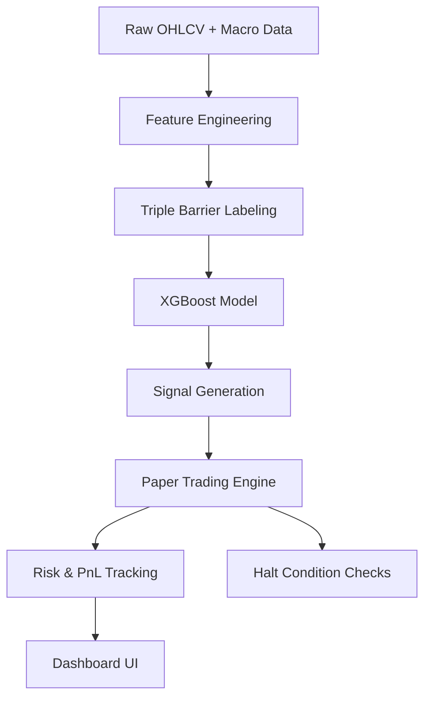

# QuantForge


QuantForge is a modular quantitative research framework for studying **macro-conditioned trading systems** across FX, equities, and crypto. It runs a **live paper-trading engine** with a web dashboard and supports walk-forward validation for systematic strategy research.

**This is a research and paper-trading system, not a production trading bot.**

---

## Live Paper Trading

The paper-trading engine runs 24/7 with three assets:

| Asset | Ticker | Allocation | Features |
|---|---|---|---|
| XLF | `XLF` | 40% | rate_diff, 2y_yield_delta_63, xlf_mom_63, xlf_vs_spy_63 |
| BTC | `BTC-USD` | 35% | rate_diff, 2y_yield_delta_63, btc_mom_63, btc_vs_spy_63 |
| NZDJPY | `NZDJPY=X` | 25% | vix_ma21, vix_delta_5, us_jp_10y_spread, nzdjpy_mom_21 |

### Run

```bash
./monitor_all
```

Dashboard: `http://127.0.0.1:5000`

- Engine refresh: 30 min
- UI refresh: 30 sec

### Dashboard

Serves a dark-themed command center with:
- Portfolio summary cards (total value, return, unrealized P&L, trades)
- Per-asset signal cards with confidence bars and position details (entry, SL, TP, P&L)
- Execution tickets table
- Live metrics per asset (profit factor, win rate, signal distribution, mean confidence)
- Halt condition monitors (max drawdown, monthly PF, signal drought, prob drift)
- Advisory bar (retrain schedule, deployment status)

---

## Research Track

The primary validated research asset is **XLF (Financial Select Sector SPDR ETF)** using a minimal 4-feature XGBoost model. Walk-forward studies also exist for EURUSD, USDJPY, NZDJPY, GC (Gold), and QQQ.

### Model

- XGBoost multiclass classifier (BUY / NEUTRAL / SELL)
- 300 trees, max depth 2, learning rate 0.02
- Triple-barrier labeling (pt_sl=2, vb=20)
- Volatility-scaled position sizing

### Run Walk-Forward

```bash
python equity/walk_forward_xlf.py
```

### Macro-Only Diagnostic

```bash
python equity/diagnostic_xlf_macro.py
```

### Research Results (XLF Walk-Forward)

**Configuration:** Train 5yr / Test 1yr / Step 1yr

| Year | PF | Net Return |
|---|---|---:|
| 2019 | 1.07 | +3.25% |
| 2020 | 1.03 | +5.12% |
| 2021 | 1.29 | +25.14% |
| 2022 | 0.98 | -6.25% |
| 2023 | 1.23 | +17.24% |
| 2024 | 1.34 | +21.95% |

Average (2019–2024): **+11.08%**

---

## Advanced Model Architecture

Beyond the minimal paper-trading models, the research framework includes:

| Module | Description |
|---|---|
| `HybridRegimeEnsemble` | Global backbone + regime-specific expert heads + protected macro expert head (0.45 fixed blend) |
| `RegimeClassifier` | Classifies markets into TREND / RANGE / VOLATILE / NEUTRAL |
| `MacroExpertHead` | Macro-only expert trained on rate differentials and yield features |
| `MeanReversionModel` | Specialized for RANGE regimes (RSI, Bollinger Band reversals) |
| `BreakoutModel` | Specialized for VOLATILE regimes (momentum, breakout continuation) |

---

## Validity State Machine

A hysteresis-based capital allocation state machine with temporal smoothing and regime persistence lock. Transforms validity scores into:

| State | Exposure |
|---|---|
| GREEN | 100% |
| YELLOW | 50% |
| RED | 0% |

Features inertia smoothing, regime persistence locking, and configurable entry/exit thresholds to prevent rapid state flipping.

---

## System Architecture



---

## Repository Structure

```text
QuantForge/
├── paper_trading/       # Live paper-trading engine + dashboard server
│   ├── engine.py        # AssetEngine, PaperTradingEngine, signal generation
│   ├── monitor.py       # Main loop: pulls data, refreshes signals, starts server
│   └── serve.py         # HTTP server serving the web dashboard
├── equity/              # Walk-forward research (XLF, EURUSD, USDJPY, NZDJPY, GC, QQQ)
├── backtests/           # Walk-forward validator, performance metrics, expectancy audit
├── models/              # Hybrid ensemble, regime classifier, expert heads
│   ├── ensemble/        # Model router
│   ├── regime/          # Regime classifier
│   ├── trend/           # Baseline XGBoost
│   ├── mean_reversion/  # Mean-reversion model
│   └── volatility/      # Breakout model
├── features/            # Feature engineering: base, regime, structural, interaction, pair-specific
├── labels/              # Triple-barrier labeling
├── signals/             # Signal generation, thresholding, filtering
├── risk/                # Position sizing, drawdown controls, exposure limits
├── monitoring/          # Validity state machine, drift detection, MLflow logger
├── data/                # Raw + processed macro data, live state
│   ├── loaders/         # yfinance + FRED data downloaders
│   ├── raw/             # Downloaded OHLCV parquet files
│   ├── processed/       # Engineered features, labeled data, macro factors
│   └── live/            # Live state.json, dashboard.json, logs
├── diagnostics/         # Model validity, signal integrity, regime audits, sweeps
├── portfolio/           # HRP allocator, risk parity, correlation clustering (stubs)
├── execution/           # Broker interface, order manager (stubs)
├── configs/             # YAML configuration for paper trading, forex, crypto
├── tests/               # pytest suite (engine, position sizing, triple barrier, state machine)
└── quantforge/          # Package init, logging setup
```

---

## Setup

```bash
git clone <repo_url>
cd QuantForge

python3 -m venv .venv
source .venv/bin/activate
pip install -r requirements.txt

export PYTHONPATH=$PYTHONPATH:.
```

---

## Tests

```bash
pytest tests/
```

---

## Key Findings

1. **Macro signal transfers across assets, but imperfectly** — macro features capture regime context but don't fully determine directional returns.

2. **Simplicity outperforms complexity (in this regime)** — the 4-feature XGBoost generalizes better than hybrid ensembles, regime classifiers, or high-dimensional feature sets.

3. **Feature separation matters** — environment features (yield_slope, real_yield) hurt; directional features (momentum, relative strength, rate expectations) help.

4. **2022 was structural, not stochastic** — performance breakdown driven by bull-biased training window and regime shift into rate tightening.

---

## Roadmap

### Near Term
- Broker integration (Alpaca / IBKR)
- Slippage + spread modeling
- Live cost tracking
- Multi-asset portfolio allocator

### Medium Term
- Multi-asset risk engine
- Real-time streaming dashboard (WebSocket)
- Drift detection + model retraining triggers

---

## Limitations

- Paper trading only — no live broker execution
- Limited validated asset universe
- No portfolio optimizer yet
- Stale data on weekends for equity/FX assets

---

## Disclaimer

Research and educational use only. Not financial advice. Markets are stochastic and adversarial. Past performance ≠ future results.

---

## Author

Built by **MktOwl**

Focus: macro-driven systematic trading, walk-forward validation, real-time paper trading systems, quantitative research engineering.
