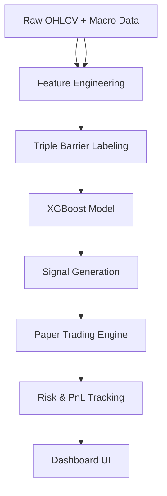

# QuantForge


QuantForge is a modular quantitative research framework for studying **macro-conditioned trading systems** across FX and equities.

The current active research track focuses on **XLF (Financial Select Sector SPDR ETF)** using a minimal 4-feature macro + price model developed after a year-long EURUSD research phase.

This is a **research and paper-trading system**, not a production trading bot.

---

## Research Questions

- Does macro signal (rate differentials, yield expectations) transfer from FX to equities?
- Can a minimal macro-price feature stack produce stable out-of-sample performance?
- When does macro context actually translate into tradeable directional edge?

---

# Current Model (Active Equity Track)

Universe:

- XLF
- SPY (benchmark)

### Feature Set

```python
XLF_FEATURES = [
    "rate_diff",
    "2y_yield_delta_63",
    "xlf_mom_63",
    "xlf_vs_spy_63",
]
```

| Feature | Role |
|---|---|
| rate_diff | Macro regime (policy divergence) |
| 2y_yield_delta_63 | Forward rate expectations |
| xlf_mom_63 | Momentum (market response) |
| xlf_vs_spy_63 | Relative strength |

### Model

- XGBoost multiclass classifier  
- 300 trees  
- max depth: 2  
- learning rate: 0.02  
- Triple-barrier labeling (pt_sl=2, vb=20)

---

# System Architecture



---

# Research Results (XLF Walk-Forward)

### Configuration

- Train: 5 years  
- Test: 1 year  
- Step: 1 year  

| Year | PF | Exp | L/S | Statistical Note |
|---|---:|---:|---:|---|
| 2019 | 1.07 | +0.000229 | 175/77 | - |
| 2020 | 1.03 | +0.000304 | 253/0 | - |
| 2021 | 1.29 | +0.001179 | 211/24 | - |
| 2022 | 0.98 | -0.000150 | 197/54 | noise (p=0.571) |
| 2023 | 1.23 | +0.000801 | 91/159 | borderline (p=0.111) |
| 2024 | 1.34 | +0.000978 | 125/127 | weak signal (p=0.047) |

### Annual Net Returns

| Year | XLF Net |
|---|---:|
| 2019 | +3.25% |
| 2020 | +5.12% |
| 2021 | +25.14% |
| 2022 | -6.25% |
| 2023 | +17.24% |
| 2024 | +21.95% |

Average (2019–2024): **+11.08%**

---

# Key Findings

### 1. Macro signal transfers, but imperfectly

Macro features capture regime context but do not fully determine directional equity returns.

---

### 2. Simplicity outperforms complexity (in this regime)

A 4-feature model currently generalizes better than:

- hybrid ensembles
- regime classifiers
- high-dimensional feature sets

---

### 3. Feature separation matters

**Environment features (removed):**

- yield_slope
- real_yield_10y

**Directional features (kept):**

- momentum
- relative strength
- rate expectation changes

---

### 4. 2022 is structural, not stochastic

Performance breakdown is attributed to:

- bull-biased training window (2017–2021)
- regime shift into rate tightening cycle

---

# Reproducibility

## Setup

```bash
git clone <repo_url>
cd QuantForge

python3 -m venv .venv
source .venv/bin/activate
pip install -r requirements.txt

export PYTHONPATH=$PYTHONPATH:.
```

---

## Run Walk-Forward

```bash
python equity/walk_forward_xlf.py
```

Expected:

```text
2024 PF ≈ 1.34
2024 p(PF<1.0) ≈ 0.047
```

---

## Macro-only diagnostic

```bash
python equity/diagnostic_xlf_macro.py
```

---

# Live Paper Trading

```bash
python -m paper_trading.monitor
```

Dashboard:

```
http://127.0.0.1:5000
```

Updates:

- engine: 30 min
- UI: 30 sec

---

# Repository Structure

```text
QuantForge/
├── equity/              # Active research (XLF, QQQ)
├── paper_trading/       # Live simulation engine
├── data/                # Raw + processed macro data
├── labels/              # Triple barrier labeling
├── models/             # XGBoost + experiments
├── risk/               # Position sizing + controls
├── diagnostics/        # Legacy EURUSD research
├── execution/          # Broker stubs (future)
└── legacy/             # Archived EURUSD phase
```

---

# Roadmap

## Near Term

- XLE transfer test
- XLI transfer test
- slippage + spread modeling
- live cost tracking

## Medium Term

- broker integration (Alpaca/IBKR)
- portfolio allocator
- multi-asset risk engine

---

# Limitations

- single primary validated asset (XLF)
- no live broker execution
- limited asset universe
- no portfolio optimizer yet

---

# Disclaimer

Research and educational use only.

Not financial advice.

Markets are stochastic and adversarial.

Past performance ≠ future results.

---

# Author

Built by **MktOwl**

Focus:

- macro-driven systematic trading
- walk-forward validation
- real-time paper trading systems
- quantitative research engineering
